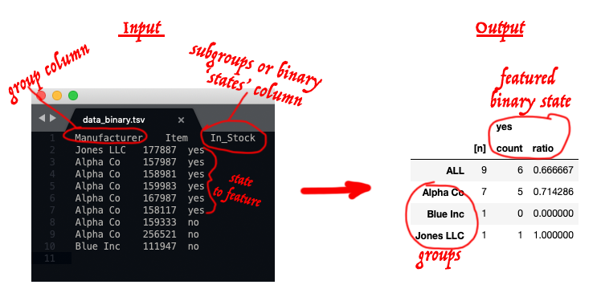
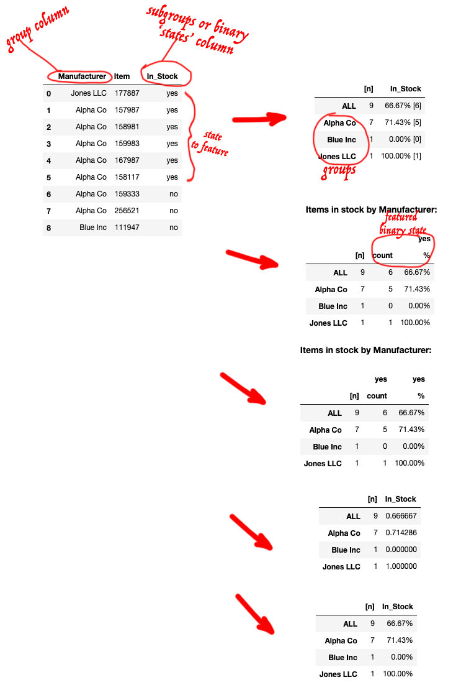

# dataframe2summary
Repo for demonstrating scripts that convert dataframes / data tables into summarized dataframes / data tables.

Click on `launch binder` badge above to spin up a sesion where you can step through the demos.

*These scripts take dataframes or tabular text (tables as text) as input.* 

If you have data as a table from elsewhere you can convert it/export into tabular text as tab-separated or comma-separated form and that can be used as input by any of the approaches here.

-----

## Demonstration notebooks

The intent is that there be (at least) **two** notebooks:  
The **first** notebook that opens in the active session demonstrates a script that makes it easy to convert a dataframe with groups and subgroups/states into a summary. like the following from a dataframe.  
Examples of typical input and results (**the red annoation is just for illustration**):

  

The **second** notebook shows how to make a summary data table much like the first notebook produces; however, this script is specialized for binary data for the subgroups, i.e., they can only have two resulting states at most.  
Examples of typical input and results (**the red annoation is just for illustration**):

  

  

-----

Click on a `launch binder` badge on this page to spin up a sesion where you can make plots.

